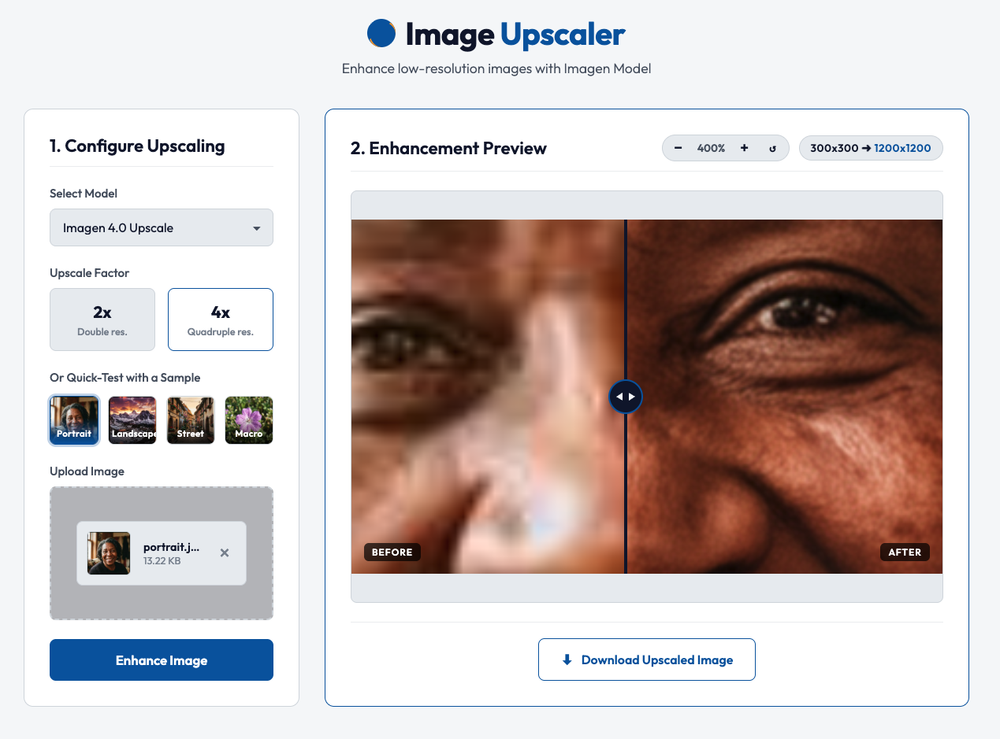

# Image Upscaler

A clean, secure single-page web application built with FastAPI and Vanilla CSS/JS to enhance and upscale images using the Vertex AI **Imagen 4.0 Upscale** and **Imagen 3.0** models via the Google GenAI SDK.

## Preview & Dashboard Layout

Here is the clean, flat, light-mode dashboard displaying a zoomed-in and panned image with the real-time interactive before/after comparison slider:



---

## Key Features

- **Quick-Test Sample Presets**: Includes 4 curated low-resolution presets (Portrait, Landscape, Street, Macro) programmatically downscaled (to 300x300 px) and compressed. Lets users instantly test and compare upscaling mechanics side-by-side without needing to upload custom files.
- **Flat Minimalist UI**: Designed with clean modern light HSL color tokens, Outfit typography, and compact layout structures without complex gradients or tacky 3D box-shadows.
- **Zoom & Pan Inspector**: Supports real-time mouse drag panning and 100%–400% zooming inside the viewer, maintaining pixel-perfect split coordinates automatically.
- **Interactive Slider**: Real-time, draggable before/after comparison slider for inspecting enhanced image details side-by-side.
- **Flexible Models**: Supports upscaling via the state-of-the-art `imagen-4.0-upscale-preview` (best quality) and `imagen-3.0-generate-002` (balanced performance).
- **Resolution Scaling**: Offers double ($2\times$) and quadruple ($4\times$) resolution upscaling.
- **Production-Ready Security & Integrity**:
  - **Strict File Sanitization**: Restricts uploaded formats exclusively to JPG, JPEG, and PNG.
  - **Magic Byte Verification**: Inspects image structure via Pillow's integrity checks before sending payloads to Vertex AI APIs.
  - **Size Restrictions**: Enforces a maximum limit of 10MB on uploaded images.
  - **Detailed Error Parsing**: Captures and explains model pixel limits or GCP permission errors clearly to the user.
  - **Automatic Cleanup**: Deletes intermediate files immediately after processing or upon server error.
  - **Local CORS Protections**: Restricts requests to local host origin to guard against cross-site scripting issues.

---

## Architecture & Directory Layout

```text
.
├── .dockerignore          # Docker build exclusions
├── .env                   # Local environment configuration
├── .gitignore             # Git build exclusions
├── README.md              # Project documentation (this file)
├── Dockerfile             # Container recipe for Cloud Run deployment
├── deploy.sh              # GCP Cloud Run automated deployment script
├── run_with_proxy.sh      # Local secure tunnel proxy runner for private Cloud Run
├── pyproject.toml         # Package configuration and dependencies
├── assets/
│   └── screenshot.png     # App preview screenshot for documentation
├── app/
│   ├── __init__.py
│   ├── main.py            # FastAPI Backend (Routing, validations, and uploads)
│   ├── upscaler.py        # Vertex AI Image Upscaling Service & Client Setup
│   └── static/
│       ├── index.html     # Single-page dashboard markup
│       ├── styles.css     # Tailored flat light HSL styles & custom widgets
│       ├── app.js         # Frontend logic, slider, zoom/pan inspector, cache-busting
│       └── samples/       # 4 downscaled & compressed JPEG quick-test sample files
└── tests/
    └── test_upscale.py    # Standalone test script for direct API calls
```

---

## Tech Stack

- **Language**: Python 3.13+
- **Backend**: FastAPI, Uvicorn
- **AI Integration**: Google GenAI SDK (`google-genai`), Vertex AI API
- **Image Processing**: Pillow (PIL)
- **Frontend**: Vanilla HTML5, CSS3, & Modern ES6 Javascript

---

## Prerequisites & Authentication

The application utilizes the **Vertex AI API** which requires authentication. Before running, ensure you have:
1. **gcloud CLI installed** and initialized.
2. Active credentials configured. Authenticate your local system:
   ```bash
   gcloud auth application-default login
   ```
   *Note: The backend automatically attempts to fetch credentials via `gcloud auth print-access-token` as a robust fallback.*

3. **Create a `.env` file** in the root directory of the project with your Google Cloud details:
   ```ini
   # Vertex AI / Google Cloud Configuration
   PROJECT_ID=your-google-cloud-project-id
   LOCATION=us-central1
   ```

---

## Quick Start

Follow these steps to run the application locally. This project uses `uv` for efficient Python package management.

### 1. Install Dependencies
First, ensure you have `uv` installed. Then, run the following command to install the package dependencies:
```bash
uv sync
```

### 2. Run the Server
Launch the FastAPI backend using the quick-start shell script:
```bash
./run_local.sh
```
*(Alternatively, you can run uvicorn directly: `uv run uvicorn app.main:app --host 127.0.0.1 --port 8000 --reload`)*

### 3. View in Browser
Once Uvicorn starts successfully, open your browser and navigate to:
[http://127.0.0.1:8000](http://127.0.0.1:8000)

---

## Standalone Command Line Testing

A helper script, `test_upscale.py`, is included inside the `tests/` directory to verify your Google GenAI API connectivity and upscaling capability independently of the FastAPI server.

Run the script using:
```bash
uv run tests/test_upscale.py
```

**What it does:**
1. Generates a dummy `test_input.png` image containing a blue circle.
2. Resolves authorization tokens securely using the local `gcloud` environment.
3. Sends the image to Vertex AI for a $2\times$ upscale enhancement.
4. Saves the returned upscale artifact as `test_output.png`.
5. Fallbacks to `imagen-3.0-generate-002` automatically if permissions for the preview model are restricted.

---

## GCP Cloud Run Deployment

You can deploy this application containerized directly to Google Cloud Run using the included deployment script.

### 1. Authenticate with gcloud
Before deploying, ensure you are authenticated and have targeted your active GCP project:
```bash
gcloud auth login
gcloud config set project YOUR_PROJECT_ID
```

### 2. Run the Deployment Script
Execute the deployment script from the root directory:
```bash
./deploy.sh
```

**What the script does:**
1. Dynamically resolves your active GCP `PROJECT_ID` and region context.
2. Submits your local directory to **Google Cloud Build** to create a secure container image remotely using the [Dockerfile](Dockerfile) (meaning you do *not* need to have Docker running locally).
3. Automatically deploys the container image to **Google Cloud Run** as a fully secured private service (`--no-allow-unauthenticated`) with port parameters bound dynamically.
4. Configures all Vertex AI `PROJECT_ID` and `LOCATION` parameters securely at runtime.

### 3. Accessing the Private Cloud Run Service (gcloud proxy)
Since unauthenticated access is disabled by default for security, the deployed service is fully private and protected.

To access the live container in your browser securely, you can tunnel dynamically using the provided helper script:
```bash
./run_with_proxy.sh
```
*(Alternatively, you can run the gcloud CLI command directly: `gcloud run services proxy imagen-upscaler --region=us-central1`)*

**What it does:**
1. Starts a secure local server proxy at `http://localhost:8080` (or another port printed in your terminal).
2. Automatically injects your active local `gcloud` authentication tokens into all request headers in real-time.
3. Forwards the traffic securely to your Cloud Run container in the cloud, allowing you to run and interact with your remote upscaler securely directly at:
   [http://localhost:8080](http://localhost:8080)

